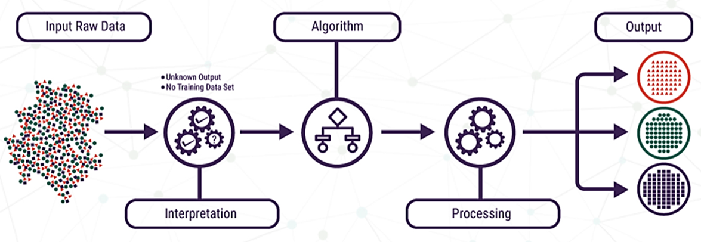
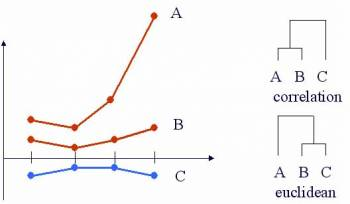
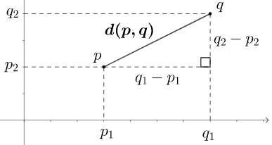
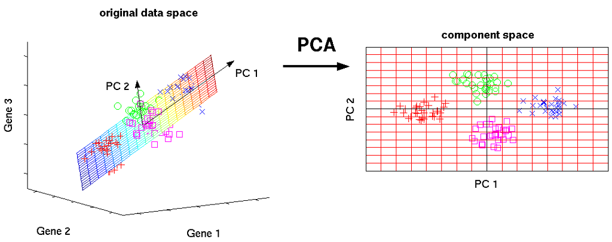
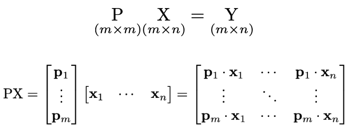
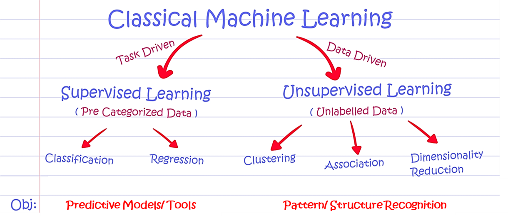

```{r setup, include=FALSE}
knitr::opts_chunk$set(echo = TRUE)
```

```{r setup_visible, results = "hide", message = FALSE, warning = FALSE}
library(ggplot2) # a popular plotting library
library(ggrepel) # an extension on ggplot2 for 
library(cluster) # a utility for clustering techniques (e.g. silhouette function)
library(readxl) # a utility for reading excel files
```

# Introduction

**Unsupervised learning** refers to a machine learning algorithm that infers information from a given dataset without any guidance. The algorithm relies on *underlying similarities and patterns* within the data to learn how the variables are related to one another. So in a way, we're "letting the data speak for itself."



This is a great tool to use for initial exploration of a dataset without any defined hypothesis. Unsupervised learning is especially valuable in assessing a large dataset with multiple variables. For today's lecture, we'll be going over two broad applications of unsupervised learning: (1) **clustering** and (2) **dimensionality reduction**. 

# Clustering

## Identifying distinct groups based on similarity

We'll be covering two types of clustering techniques: **hierarchical** and **k-means** clustering. To introduce these methods, we'll consider the following planetary data:

```{r planet_plot}
planet_data = read.csv("planets.csv") # reading in the planet data
planet_data
colnames(planet_data) = c("name", "density","rad") # setting new, simpler column names
planet_plot = ggplot(planet_data, aes(x = density, y = rad, label = name)) +
  geom_point(size = 5) + geom_label_repel(aes(label = name)) + 
  ggtitle("Radius and Average Density of Planets") +
  xlab("Density (g/cm^3)") + ylab("Radius (km)")
planet_plot # visualizing data
```

## Hierarchical Clustering

In **hierarchical clustering**, each observation starts in its own cluster at the base of the hierarchy. As we move up the hierarchy, observations that are most similar group together first until all observations are linked. 

This hierarchy of observations is often depicted as a **dendrogram**. In R, we can generate one using the `heatmap` function to visualize how similar the observations (e.g. planets) are based on different measurements (e.g. density, radius). The plot below shows an example of hierarchical clustering of planets in the solar system based on their average density and radius: 

```{r hierarchical_clustering}
# subset the data frame to only the numeric values
numeric_planet_data = as.matrix(planet_data[,c("density","rad")]) 

# visualize data after hierarchical clustering
heatmap(numeric_planet_data, Colv=F, scale='none',
        labCol = c("Density (g/cm^3)", "Radius (km)"),
        labRow = planet_data[,1],
        xlab = "Measurment", ylab = "Planet", cexCol = .6)
```

You may have noticed that the radius column doesn't show any differences between planets. This is because the range of values represented by the color gradient is limited to 1 through 7 (recall that planet radius was in the 10,000 range). To have a better visual sense in how a metric (e.g. radius) differs between observations (e.g. planets), we can scale the values within a metric by setting `scale = "col"`. Below is what the same clustergram of planetary data would look like with scaled density and radius: 

```{r standardized_hierarchical_clustering}
# standardize columns
heatmap(numeric_planet_data, Colv=F, scale = "col",
        labCol = c("Density (g/cm^3)", "Radius (km)"),
        labRow = planet_data[,1],
        xlab = "Measurment", ylab = "Planet",cexCol = .6)
```

## Defining Similarity

One of the most common ways to apply unsupervised learning is to assess the similarity within a dataset. Similarity can be quantitatively described using a **distance metric** between two variables. There are various types of distance metrics that can be used, but we'll just go over two of the most common ones: **Euclidean** and **correlation** distance. The plot below shows how these distance metrics differ:



### Euclidean Distance
The **Euclidean distance** is broadly defined by the following formula: 


This is what the distance between p and q would look like when n = 2



When analyzing biological data in R, we'll mostly be dealing with large vectors. In these cases, n is equal to the length of the vectors we're comparing (*note*: the vectors must have the same length). 

For instance, let's say we're comparing vectors a and b as defined below:

```{r a_b}
a = c(2,8,1,6)
b = c(5,8,4,8)
```

For this example, n = 4. We can calculate the Euclidean distance manually: 

```{r manual_euclid}
vector_diff = a - b
square_diff = vector_diff^2
sum_square_diff = sum(square_diff)
euclid = sqrt(sum_square_diff)
euclid
```

We can also use the `norm` function in R: 

```{r norm_dist}
euclid = norm(vector_diff, type = "2")
euclid
```

Where `type = "2"` refers to the L2 norm (another way to refer to the Euclidean distance).

### Correlation Distance

Another commonly used distance metric is **correlation**, and this is broadly defined as follows: 


where r is the *correlation coefficient* between two vectors. 

Going back to our example vectors a and b, the correlation distance can be calculated manually using the `cor` function:

```{r correlation_distance}
correlation_distance = 1 - cor(a,b)
correlation_distance
```

Note that the correlation distance can only range from 0 (similar) to 2 (dissimilar). 

`cor` has an additional `method` parameter, which specifies which method to use when calculating the correlation. Available options include `pearson`(default), `spearman` and `kendall` correlation.

## K-means Clustering

For **k-means clustering**, we specify how many distinct groups we think that the data will cluster into. The algorithm then allocates data points to a cluster by minimizing the *in-cluster sum of squares* (more on this later). The value for k is typically chosen based on a priori information we may have on the data. Referring back to our planetary data, planets in the solar system can be defined as [gas giants or rocky planets](http://history.amazingspace.org/resources/organizers/rock_v_gasplanets.php):

```{r plant_plot_split}
planet_plot + 
  geom_vline(xintercept=2, linetype="dashed", color = "black") +
  geom_text(label = "Gas giants", x = 1, y = 40000, color = "red") +
  geom_text(label = "Rocky planets", x = 4, y = 40000, color = "blue")
```
Based on this additional information, we could apply k-means clustering with k = 2 to group our planets: 

```{r planet_kmeans}
k_2_idents = kmeans(numeric_planet_data, centers = 2) # run k-means with k = 2
idents_2 = as.factor(k_2_idents[["cluster"]]) # convert output to categorical variable
planet_data$idents_2 = idents_2 # add clustering info to planet_data
ggplot(planet_data, aes(x = density, y = rad, label = name, color = idents_2)) +
  geom_point(size = 5) + geom_label_repel(aes(label = name)) + 
  ggtitle("Radius and Average Density of Planets") +
  xlab("Density (g/cm^3)") + ylab("Radius (km)") +
  theme(legend.position = "none")
```

This is probably not how we expected the planets to cluster based on our reason to use k = 2. However, if we [delve deeper](http://www.solstation.com/stars/jovians.htm) into the information we were given before: 

```{r plant_plot_split_3}
planet_plot + 
  geom_vline(xintercept=2, linetype="dashed", color = "black") +
  geom_hline(yintercept = 40000, linetype="dashed", color = "black") +
  geom_text(label = "Gas giants", x = 1, y = 50000, color = "red") +
  geom_text(label = "Ice giants", x = 1, y = 10000, color = "purple") +
  geom_text(label = "Rocky planets", x = 4, y = 30000, color = "blue")
```

Let's see how the planets cluster based on k-means clustering with k = 3: 

```{r planet_kmeans_3}
k_3_idents = kmeans(as.matrix(planet_data[,2:3]), centers = 3, nstart=25)
idents_3 = as.factor(k_3_idents[["cluster"]]) 
# add an additional column to planet_data with the clustering generated by kmeans
planet_data$idents_3 = idents_3 

ggplot(planet_data, aes(x = density, y = rad, label = name, color = idents_3)) +
  geom_point(size = 5) + geom_label_repel(aes(label = name)) + 
  ggtitle("Radius and Average Density of Planets") +
  xlab("Density (g/cm^3)")+
  ylab("Radius (km)") + 
  theme(legend.position = "none")
```

Now our results match what we expected based on our reason to use k = 3.

### Silhouette Analysis

You must be wondering: what if we don't have any prior knowledge of the data? What value do we use for k, and how do we know if this was a good choice? To consider these questions, we can conduct a **silhouette analysis** to determine which k value best minimizes the in-cluster sum of squares. For this analysis, we calculate the silhouette value for each observation and assess how they compare within a cluster by generating a **silhouette plot**. *The silhouette value measures how similar an observation is to its own cluster compared to others based on a distance metric*. This value ranges from -1 to 1, where a higher positive value implies that an observation is well-matched to its cluster and vice-versa. 

One way to assess whether we chose a good value for k is to evaluate the mean of all silhouette values. For the purposes of this lesson, we'll refer to this mean value as the silhouette score. In general, a **silhouette score** above 0.5 indicates that the data is well-separated. The following code calculates the silhouette score for our planetary data based on k-means clustering with different k values and visualizes the clustered data: 

```{r silhouette_plot}
# compute distance (Euclidean) between planets
dist_planets = dist(numeric_planet_data)

# define a function to determine the silhouette score
k1 = 2; k2 = 5 # define k range as [k1, k2]
silhouette_score <- unlist(lapply(k1:k2, function(k){
  # run kmeans for a given value of k
  k_means <- kmeans(numeric_planet_data, centers = k, nstart=25) 
  # generate silhouette values for each cluster
  silhouette_out <- silhouette(k_means$cluster, dist_planets) 
  # convert the output of the silhouette function into a matrix
  sil_mat = matrix(silhouette_out,ncol = 3) 
  # subset the matrix to the silhouette scores
  sil_mat = sil_mat[,3] 
  # return the mean of slihouette values (silhouette score)
  return(mean(sil_mat)) 
}))

# create a data frame with values of k and their associated silhouette scores
silhouette_df = data.frame(clusts = as.factor(k1:k2), score = silhouette_score) 

# visualize how the silhouette score changes with k
ggplot(silhouette_df, aes(x = clusts, y = score)) +
  geom_bar(stat = "identity") +
  ggtitle(sprintf("Silhouette scores for k range of %d to %d", k1, k2)) +
  xlab("k") + ylab("Silhouette Score") + 
  theme(legend.position = "none")
```

*Note*: As the placement of a cluster centroid is random for every iteration, clustering results may fluctuate between runs. The `kmeans` function contains additional properties that can be used to address this problem. To easily increase the stability, increase the `nstart` parameter to a value above 1.

## Hierarchical vs. K-means Clustering

Both hierarchical clustering and k-means clustering are unsupervised learning methods for grouping data based on similarity. The difference between these two clustering methods is that hierarchical clustering takes a **"bottom-up" approach**, whereas k-means clustering takes a **"top-down" approach**.

### Section Summary
In R, we can perform hierarchical clustering using the `hclust` function, and k-means clustering using the `kmeans` function. The `silhouette` function is used to calculate the silhouette value for each observation based on its cluster assignment from k-means clustering.

# In-class practice: clustering of the Framingham data

## Applying hierarchical clustering based on health measurements

Let's say we want to know if individuals who suffered from a heart attack were similar across their health measurements (e.g. heartrate, BMI) using hierarchical clustering. We would also like to know if the health profile for this group was different from that of individuals who did not have a record of heart attack. The first step is to load the data and define the subset we're interested in:
  
```{r subset_fram}
fram = read_excel("frmgham.xls") # reads data from an excel file
# create a list of columns to subset 
subset_vars = c('HOSPMI','TOTCHOL','SYSBP','DIABP','BMI','HEARTRTE','GLUCOSE','HDLC','LDLC') 
fram_health = fram[,subset_vars] # subset the object to the defined columns
head(fram_health) # display the first several rows of the subset data
```

We'll remove rows containing NaN values and get the subset for the first 50 entries. We'll also create a variable for the heart attack occurrence and a numerical array for the health measurement data:
  
```{r rm_fram}
rm_fram = apply(fram_health, MARGIN = 1, function(x){
  na_fram = is.na(x) # find a vector of all NA values in the row
  rm_row = any(na_fram) # find indices of rows containig NA values
  return(!rm_row) # indices of rows without NA values
})
fram_health = fram_health[rm_fram,] # subset to rows without NA values
fram_health = fram_health[1:50,] # subset to the first 50 rows
hospmi_vec = as.vector(fram_health$HOSPMI) # converts the HOSPMI column to a vector
heart_attack = factor(hospmi_vec); # converts HOSPMI into a categorical variable
levels(heart_attack) = c("No","Yes") # labels the categories
fram_health_data = fram_health[,2:ncol(fram_health)] # removes HOSPMI from the data frame
fram_health_data = as.matrix(fram_health_data) # converts the data frame to a matrix
head(fram_health_data) # display the first several rows of the matrix
```  

Now we can perform hierarchical clustering for this data subset. For this example, we'll use Euclidean distance (default) as our distance metric for assessing similarity. We'll also cluster along both rows and columns (default) and provide labels (rows = heart attack occurrence, columns = health measurements). Finally, we'll standardize each column to better compare measurements between patients:

```{r clustergram}
heatmap(fram_health_data, Colv=F, scale = "col", labRow = heart_attack, 
        xlab = "Variable", ylab = "Patient", cexCol = .6)
```

This clustergram shows how specific measurements compare between patient clusters, and which patients are most similar based on Euclidean distance. 

### Question: Did individuals who suffered from a heart attack cluster together?

<input type="text" id="answer" name="answer" size="100"/>

Let's see how the clustergram changes if we use Pearson's correlation as our distance metric:
```{r clustergram_pearson}
cols.cor <- cor(fram_health_data, use = "pairwise.complete.obs",
                method = "pearson") # finds the pearson correlation between columns
rows.cor <- cor(t(fram_health_data), use = "pairwise.complete.obs",
                method = "pearson") # finds the pearson correlation between rows
hclust.col <- hclust(as.dist(1-cols.cor)) # hierarchical clustering on columns
hclust.row <- hclust(as.dist(1-rows.cor)) # hierarchical clustering on columns
heatmap(fram_health_data, scale = "col", labRow = heart_attack, 
        xlab = "Variable", ylab = "Patient",
        Colv = as.dendrogram(hclust.col), Rowv = as.dendrogram(hclust.row))
```

### Question: How did the clustering change when using correlation as our distance metric? Did individuals who suffered from a heart attack cluster together?

<input type="text" id="answer" name="answer" size="100"/> 

## Applying k-means clustering for the Framingham data

To more easily visualize k-means clustering, we'll consider how the previous set of patients cluster solely based on **cholesterol** and **LDLC levels**: 
  
```{r chol_ldlc}
fram_chol = fram_health[,c('HOSPMI','TOTCHOL','LDLC')]
```

Let's assess the silhouette scores for k = 2 to k = 10: 
  
```{r k_means}
df = as.data.frame(fram_chol) # convert to data frame
k1 = 2; k2 = 10 # define k range as [2, 10]
silhouette_score <- unlist(lapply(k1:k2, function(k){
  k_means <- kmeans(df, centers = k, nstart=25)
  silhouette_out <- silhouette(k_means$cluster, dist(df))
  return(mean(matrix(silhouette_out,ncol = 3)[,3]))
}))

silhouette_df = data.frame(clusts = as.factor(k1:k2), score = silhouette_score)
ggplot(silhouette_df, aes(x = clusts, y = score)) +
  geom_bar(stat = "identity") +
  ggtitle(sprintf("Silhouette scores for k = %d to %d", k1, k2)) +
  xlab("Cluster") + ylab("Score") + 
  theme(legend.position = "none")
```

Let's visualize a scatter plot of our data clustered into k = 2 groups:
  
```{r scatter_k_means}
fram_chol_sub = fram_chol[,c("TOTCHOL","LDLC")] # subset to cholesterol and LDLC
fram_chol_sub = as.matrix(fram_chol_sub) # convert to a numeric matrix
k_2_idents = kmeans(fram_chol_sub, centers = 2) # apply k-means with k = 2
df = data.frame(fram_chol, Clusters = as.factor(k_2_idents$cluster)) # data frame to plot

ggplot(df, aes(x = TOTCHOL, y = LDLC, color = Clusters)) +
  geom_point(size = 2) +
  ggtitle("K-means Clustering of Framingham data (k = 2)") +
  xlab("Total Cholesterol") + ylab("LDLC") +
  theme(legend.position = "none")
```

### Question: Does one of our clusters encompass individuals who have suffered from heart attack?

<input type="text" id="answer" name="answer" size="100"/> 

### Activity: How can we modify the code above to apply k-means clustering for k = 3? How does the silhouette score compare between k = 3 and k = 2?

# Dimensionality Reduction

Biomedical data is often tremendously large and highly complex. Thus, it's hard to interpret this data when considering all the information available. By applying **dimensionality reduction**, we can transform the data into a lower-dimension representation that is much easier to interpret. In this lesson, we'll go over one type of dimensionality reduction method called **principal component analysis**, or **PCA**. 

## Principal Component Analysis

In PCA, an *orthogonal linear transformation* is applied to the data, projecting it onto a new coordinate system defined by principal components.



A **principal component (PC)** is a linear combination of the **features**, or descriptive variables, in the dataset. Note that the number of features dictates the number of PCs that are determined. In the image below, **P** represents the matrix of PC coefficients that are used to linearly transform the original data (**X**) into a new representative data (**Y**) that can be visualized in PC space:


  
In PCA, **P** (matrix of PC coefficients) is typically determined by **eigenvalue decomposition (EVD)** of the data covariance matrix, or **singular vector decomposition (SVD)** of the data. For this lesson, we'll not delve into the specifics of how EVD or SVD is applied (for more information, refer to [this link](https://builtin.com/data-science/step-step-explanation-principal-component-analysis) for EVD and [this link](https://towardsdatascience.com/svd-8c2f72e264f) for SVD). 

*Note*: refer to the `prcomp` in the R `stats` package documention for additional information on algorithms used for PCA. 

### Why do PCA?

The main goal when conducting PCA is to determine a reduced representation of the original data that can be visualized. This is done by determining a *ranked list of linearly independent PCs* that altogether describe the **variance** within the data. This list of PCs is ranked by decreasing percentage of variance explained, where the first PC explains the most variance, or is best representative, of the data. 

## Example: applying PCA for the Framingham data

For this analysis, we'll consider the same dataset of health measurements we used for hierarchical clustering. Recall that this dataset contains 8 measurements, or features. This means that we'll be determining 8 linearly independent PCs by peforming PCA. Let's first normalize this data by setting the `scale` parameter to `TRUE`, then determine the matrix of principal components (`coeff`), the matrix of the transformed data (`score`), and a vector for the variance explained by each PC (`explained`):

```{r prcomp}
pca_out = prcomp(fram_health_data, scale = TRUE) # run PCA
coeff = pca_out$rotation
head(coeff)
```

```{r score}
score =  pca_out$x
head(score)
```

```{r pc_val_fram}
variance = pca_out$sdev^2 # calculate variance
prop_variance = 100 * variance/sum(variance) # calculate % variance explained by each PC
pcs = paste0("PC_", 1:length(prop_variance)) # generate a vector of PC names (PC_1, PC_2, ... )

# create a data frame with the principal component names and variance data
pca_var_df = data.frame(PC = pcs, Variance = prop_variance) 
ggplot(pca_var_df, aes(x = PC, y = Variance)) +
  geom_bar(stat = "identity") +
  ggtitle("Variance explained by Principal Component") +
  xlab("PC") + ylab("Variance Explained (%)") + 
  theme(legend.position = "none")
```

For the example shown above, we are able to represent ~50% of the variance using the first two PCs. In other words, a plot of PC1 vs. PC2 provides a two-dimensional representation of the data that explains ~50% of the variance. 

*Note 1*: Each PC is a linear combination of the features; thus, PCs differ in the weights (or coefficients) associated with the features. If a PC (e.g. PC1) can describe most of the variance in the data (> 50%), then we can evaluate the coefficients in this PC to see which feature(s) are most important (have the greatest absolute weight). In other words, the coefficient values for a PC can tell us which features are most responsible for the patterns seen in our data.

*Note 2*: As the new representations of the observations in the PC space are linear combinations of the original variables (features), it's important to normalize the data before conducting PCA. This ensures a unit variance for all variables, thus allowing comparable contributions from all variables when the data is transformed. In other words, normalizing the data reduces any bias there might be for a particular feature.

Now we'll visualize our transformed data in the component space by plotting PC1 vs. PC2. We'll also use our variable for heart attack occurrence to label our data: 

```{r pca_fram}
# create a data frame with the first two PCs and heart attack information
pca_df = data.frame(PC1 = score[,1], PC2 = score[,2], heart_attack = heart_attack) 

# visualize PC1 vs. PC2
ggplot(pca_df, aes(x = PC1, y = PC2, color = heart_attack)) +
  geom_point(size = 3) + labs(color = "Heart attack") +
  ggtitle("PCA of Framingham data")
```

Based on this plot, we can see that individuals who suffered from a heart attack cluster within the positive range along PC1. We can check the coefficient matrix (`coeff`) to see which features contribute the most (i.e. have the highest absolute coefficient) for PC1:

```{r coeff_p1}
sort(abs(coeff[,"PC1"]), decreasing = TRUE)
```

# Unsupervised vs. Supervised Learning

All of the methods discussed in this lesson serve as applications for **unsupervised learning**. In machine learning, we can also process data using **supervised learning**, where information on the output data (e.g. labels) is considered during the learning process. While unsupervised learing is used for data exploration, supervised learning is typically used to train and develop predictive or classification tools based on labeled data. 



# Summary

- Unsupervised learning allows us to infer information about a dataset without any user guidance based on **underlying similarities and patterns**

- Common applications of unsupervised learning to analyze biomedical data include **clustering** (hierarchical, k-means) and **dimensionality reduction** (principal component analysis)

- **Hierarchical clustering** involves a "bottom-up" approach, whereas **k-means clustering** applies a "top-down" approach, to assign data into groups

- **Principal component analysis (PCA)** allows us to transform highly complex data into lower-dimension representations that are easier to interpret

- In contrast to unsupervised learning, **supervised learning** includes information on the output variables (e.g. labels) that can be used to train and develop predictive or classification tools 

## R functions covered in this lesson:

* `heatmap` - generates a heatmap with dendrograms for both rows and columns

* `norm` - calculates vector and matrix norms, including the L2 norm (i.e. Euclidean distance)

* `cor` - calculates the Pearson, Spearman, or Kendall correlation of two objects

* `kmeans` - generates k clusters of the given samples using k-means

* `silhouette` - calculate silhouette values based on k-means clustering

* `prcomp` - runs PCA on a given numeric matrix

* `read.csv` - loads data from an excel file

* `colnames` - accesses the column names attribute of an object

* `c` - collates all parameters into a list object

* `as.matrix` - converts a given object into a matrix

* `round` - returns the nearest whole number

* `runif` - samples *a* values between *b* and *c* from a uniform distribution

* `sum` - takes the sum of all values in a given object

* `sqrt` - takes the square root of all values in a given object

* `cbind` - binds column objects together

* `unlist` - converts a list into a vector

* `lapply` - runs a function on each element of a list

* `dist` - calculates the distance between rows of a given object

* `matrix` - creates a matrix from the given object

* `data.frame` - generates a data frame, with each parameter as a column 

* `as.data.frame` - converts the given object into a data frame

* `apply` - runs a function on each row and/or column of a list

* `is.na` - returns an object of conditionals representing if entries equal NA

* `any` - returns `TRUE` if any values passed are `TRUE`

* `!` - inverts the value of a conditionals

* `levels` - accesses the level (i.e. categories) attribute of an object

* `factor` - converts the object to a categorical variable

* `ncol` - returns the number of columns in an object

* `head` - displays the first several rows of an object

* `t` - transposes the given object

* `as.dist` - converts the input to a distance matrix
